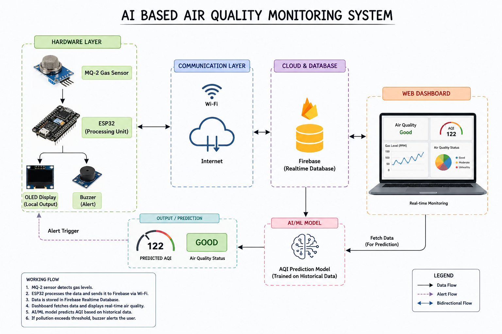

# Ai-AQI

Smart IoT-based air quality monitoring system with real-time data tracking and AI prediction  
it would basically contains two sides first is the hardware and second will be the software which is the main part in it.

## Current Progress

Repository structure completed  
Hardware connection planning completed  
Basic ESP32 sensor reading code added  
Preparing for live hardware testing  
Dataset uploaded for AQI prediction model  
Dataset preprocessing completed  
Initial AQI prediction model training started  
Currently using PM2.5 as the initial parameter for prediction  
Basic frontend dashboard created using HTML and CSS  
AQI monitoring cards added to dashboard  
Predicted AQI section added  
AQI graph placeholder added for future visualization  
System architecture documented  

### System Architecture

The following diagram represents the workflow of the AI-driven air quality monitoring and prediction system.

## Future Work

Complete AQI prediction model training using multiple parameters  
Backend development and API integration  
Frontend and backend connection  
Cloud database integration  
ESP32 live data collection and testing  
Alert system implementation  
Final deployment and project demonstration  

## Resumed project development work  again 
Resumed project development after a short break and continuing with model improvement and backend integration.  
